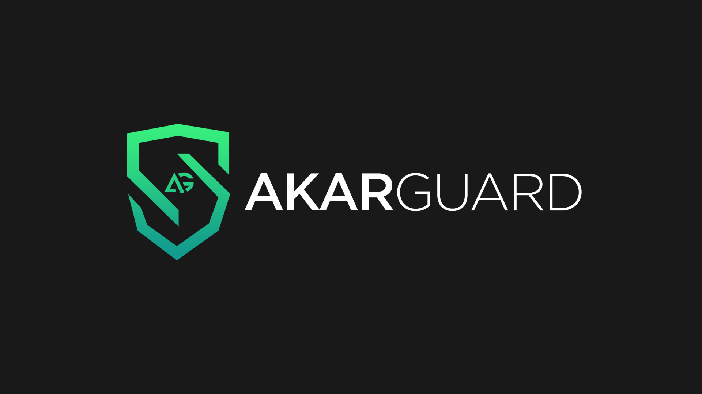

# Multi Tool Simple
## Don't abuse!

## req?
1. Install Python 3.10

# Libraries I use;

- [Here](https://pypi.org/project/subprocess32/) Subprocess
- [Here](https://pypi.org/project/colorama/) Colorama
- [Here](https://pypi.org/project/time-tools/) Time
- [Here](https://pypi.org/project/os0/) OS
- [Here](https://pypi.org/project/requests/) Requests
- [Here](https://pypi.org/project/sockets/) Sockets
- [Here](https://pypi.org/project/threading2/) Threading
- [Here](https://nmap.org/download.html) NMAP

# My Social Media Acc:

- [AkarGang Discord](https://discord.gg/6zWuHBmxvX) My discord address
- [Instagram](https://instagram.com/diabloakar) My Instagram address
- [Youtube](https://www.youtube.com/channel/UCsNTY2G3WUQgUt3QHMWgBoQ) My Youtube address

-  **"If you have any questions, feel free to ask.."** 

# My Project:

1. `AkarGuard` Powerful ddos ​​protection system.
-  Layer 7 ddos protec-> akarguard.xyz

2. `AkarBullet` A project I made for Bruteforce
3. there are so many, just know them ;)

# Signed by AkarGang

